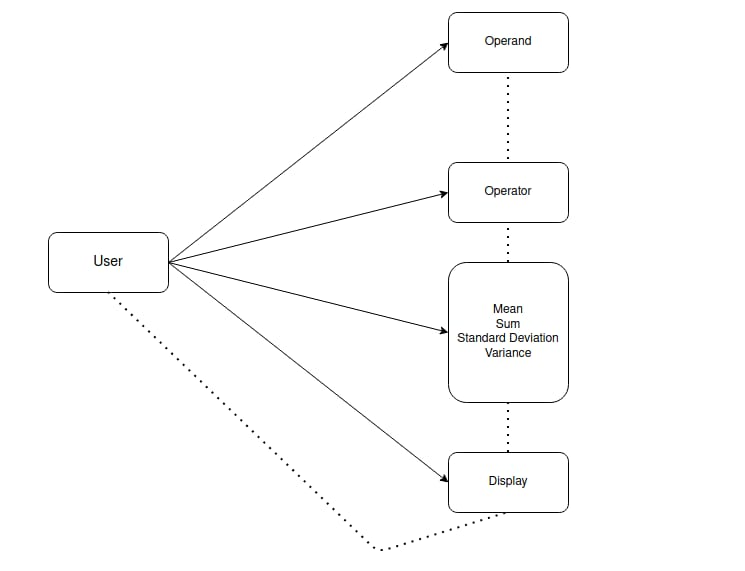
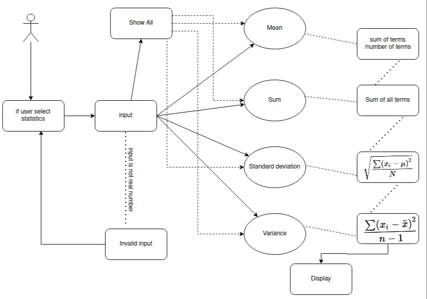

low level requirements readme

<h1>Basic Operations</h1>
<h2>Class diagram</h2>

<h2>Use Case diagram</h2>

<h1>Statistics calculations </h1>
<h2>Structural diagram</h2>

<h2>Behavioral diagram</h2>

