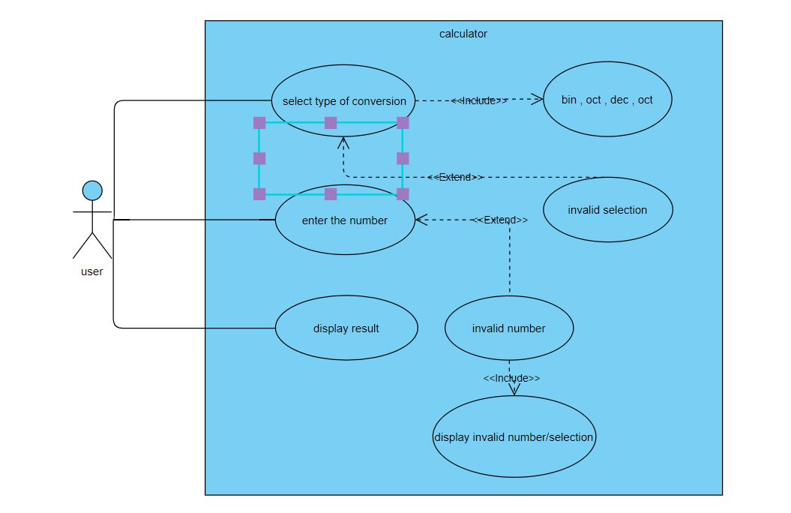
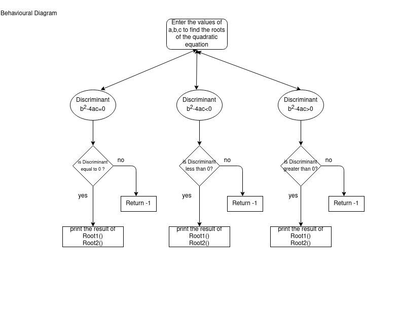

low level requirements readme

<h1>Basic Operations</h1>
<h2>Class diagram</h2>

<h2>Use case diagram</h2>

<h1>Base conversions</h1>
<h2>Class diagram</h2>

unitconvertion_structural.png

<h2>Use case diagram</h2>

<h1>Exponential operations</h1>
<h2>Class diagram</h2>

<h2>Use case diagram</h2>

<h1>Statistics operations</h1>
<h2>Class diagram</h2>

<h2>Use case diagram</h2>

<h1>Unit conversions</h1>
<h2>Class diagram</h2>

<h2>Use case diagram</h2>

<h1>Quadratic equations</h1>
<h2>Class diagram</h2>

<h2>Use case diagram</h2>

<h1>Reverse conversion</h1>
<h2>Class diagram and Behavioural diagram </h2>

