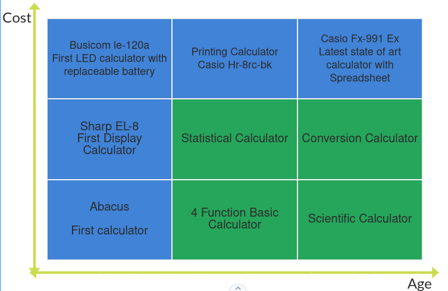

# Requirements of the project

  
# Requirements

To develop a scientific calculator which has not only the arithmetic functionality but also there are other functionalities such as special functions (i.e., square root, factorial, prime, etc.), trigonometric functions and conversion functions (i.e., meter to centimeter, etc.)

**STATE OF ART** :

- AGEING:
  - The first programmable calculator was given by HP that released in1968.
  - Later in 1972, the first pocket calculator came intopicture.
  - Nowadays, we can see that more than physical calculators people prefer the used of onlinecalculators.
- COSTING: Most of the physical calculators are costly however this project would reduce the cost to a huge extent as it is free to use.

# 4W1H

- What: Our product is a portable calculating device used for computations like addition,subtraction etc.along with complex computations like logarithm, exponential, trigonometric etc.,

- Why: To reduce time consumption required to do computationsmanually.

- When: It is used when we required computations with functions which cannot be easilydefined.

- Where: Complex, complicated computation is needed in in fields of aerospace, mathematics, engineeringetc.,

- How: Scientific calculator can be used with the numbers along with defined functions required for the computation.

### High LevelRequirements  

| **ID** | **Description** |
| --- | --- |
| HL1 | Arithmetic Functions |
| HL2 | Statistical Function |
| HL3 | Trigonometric Functions |
| HL4 | Conversion Functions |
| HL5 | Logical Functions |
| HL6 | Algebraic Functions |
| HL7 | Base Conversions |
| HL8 | Matrix Functions |
| HL9 | Exponential Functions |

### Low LevelRequirements

| **ID** | **Description** |
| --- | --- |
| HL1\_L1 | Add |
| HL1\_L2 | Subtract |
| HL1\_L3 | Multiply |
| HL1\_L4 | Divide |
| HL4_L1 | Centimeter to meter |
| HL4_L2 | Centimeter to Kilometer |
| HL4_L3 | meter to Centimeter |
| HL4_L4 | meter to Kilometer |
| HL4_L5 | Centimeter to inch |
| HL4_L6 | Celcius to farenheit |
| HL4_L7 | Celcius to kelvin |
| HL4_L8 | farenheit to celcius |
| HL4_L9 | kelvin to celcius |
| HL4_L10 | gram to kilogram |
| HL4_L11 | kilogram to gram |
| HL6_L1 | Qudratic equations  |
| HL6_L2 | logic AND |
| HL6_L3 | logic OR  |
| HL6_L4 | logic NOT  |
| HL6_L5 | logic XOR  |
| HL6_L6 | logic XNOR  |
| HL6_L7 | null matrix |
| HL6_L1 | symmetric matrix  |
| HL6_L1 | diognal matrix  |
| HL6_L1 | row matrix |
| HL6_L1 | exponentially increasing function|
| HL6_L1 | exponentially decreasing  function|
| HL6_L1 | quadratic  function|
| HL6_L1 | satistics-mean|
| HL6_L1 | satistics-mode|
| HL6_L1 | satistics-medain|
| HL9_L1 | Increasing Exponential function |
| HL9_L2 | Exponential function (input = 0) |
| HL9_L3 | Decreasing Exponential function |
| HL9_L4 | Exponential function (input = complex number) |

