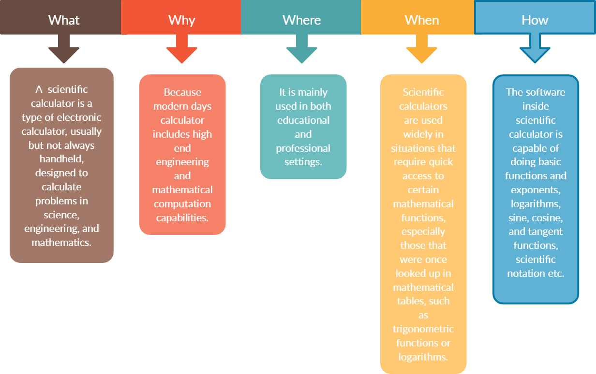

# Requirements of the project

  
# Product Description:
Our product is a calculator which has not only the basic arithmetic capabilites but there are also other functions such as special functions (i.e., square root, factorial, prime, etc.), trigonometric functions,conversion functions (i.e., meter to centimeter, etc.),Statistical functions(mean,median,variance,mode) and Boolean functions(AND, OR, NOT, XOR, XNOR).

# SWOT Analysis:

# Strengths:
- Can be used for both simple and complex calculations.
- Vast usage in market and integrating it with other various devices.

# Weaknesses:
- Numbers of inputs are limited.
- Cannot represent graphs.
- can't store data.

# Opportunities:
- Must have device for students for its high functionality and low cost.

# threats:
- Cannot be compared with the latest calculators that have spreadsheets, graphs etc.

# 4W1H

- What:  
  Our product is a portable calculating device used for computations like addition,subtraction etc. along with complex computations like logarithm, exponential,     trigonometry etc.

- Why:  
  To reduce time consumption and simplify calculations.

- When:  
  It is used when we required computations with functions which cannot be easily defined.

- Where:  
  Complex and complicated computation is needed in the fields of Finance,Mathematics,Engineering etc.

- How:  
  Our product can be used with limited inputs to perform calculations.It has pre-defined functions that can be used for computing complex problems.

### High Level Requirements  

| **ID** | **Description** |
| --- | --- |
| HL1 | Arithmetic Functions |
| HL2 | Statistical Function |
| HL3 | Trigonometric Functions |
| HL4 | Conversion Functions |
| HL5 | Logical Functions |
| HL6 | Algebraic Functions |
| HL7 | Base Conversions |
| HL8 | Matrix Functions |
| HL9 | Exponential Functions |

### Low Level Requirements

| **ID** | **Description** |
| --- | --- |
| HL1\_L1 | Add |
| HL1\_L2 | Subtract |
| HL1\_L3 | Multiply |
| HL1\_L4 | Divide |
| HL4_L1 | Centimeter to meter |
| HL4_L2 | Centimeter to Kilometer |
| HL4_L3 | meter to Centimeter |
| HL4_L4 | meter to Kilometer |
| HL4_L5 | Centimeter to inch |
| HL4_L6 | Celcius to farenheit |
| HL4_L7 | Celcius to kelvin |
| HL4_L8 | farenheit to celcius |
| HL4_L9 | kelvin to celcius |
| HL4_L10 | gram to kilogram |
| HL4_L11 | kilogram to gram |
| HL6_L1 | Qudratic equations  |
| HL6_L2 | logic AND |
| HL6_L3 | logic OR  |
| HL6_L4 | logic NOT  |
| HL6_L5 | logic XOR  |
| HL6_L6 | logic XNOR  |
| HL6_L7 | null matrix |
| HL6_L1 | symmetric matrix  |
| HL6_L1 | diognal matrix  |
| HL6_L1 | row matrix |
| HL6_L1 | exponentially increasing function|
| HL6_L1 | exponentially decreasing  function|
| HL6_L1 | quadratic  function|
| HL6_L1 | satistics-mean|
| HL6_L1 | satistics-mode|
| HL6_L1 | satistics-medain|

